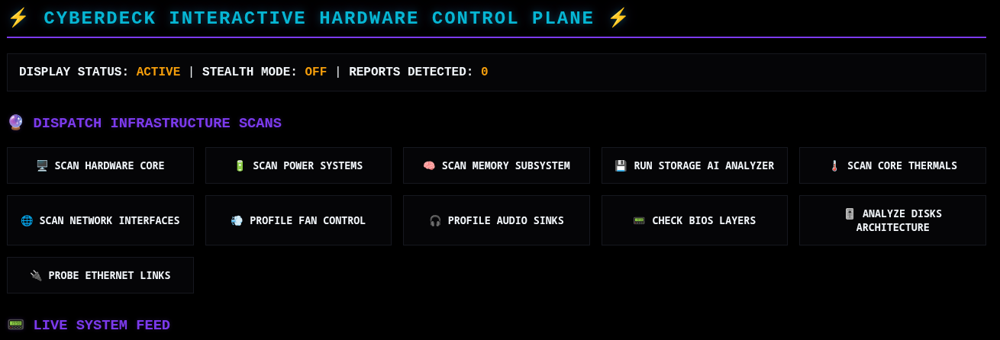

# 📟 CYBERDECK

### *The Ultimate Systems Intelligence Framework*



> **Status:** *Under Active Development* | **Language:** Rust *(2021)*
> 
> **Current Version:** **0.1.0** *(SemVer)*
> 
> **🛡️ <mark>Engineering Note</mark>: [Stack Stability]**

> **Why 2021?** Cyberdeck is anchored in a hardened, 2021-era toolchain.
> In systems-critical coding, "latest" doesn't always mean "better." While many in the industry chase the volatility of the bleeding edge, I chose to make this project as rock-solid as possible while maintaining auditability and predictable performance. By utilizing this tried and true stack, we eliminate the unnecessary churn of rapid-release cycles, ensuring that your system intelligence engine remains rock-solid and reliable under any conditions.

---

## ⚡ The Origin

**Cyberdeck** wasn't born in a boardroom; it was forged on **Arch Linux**, fueled by the specific, high-performance needs of a **Hyprland** workflow. I was tired of gluing together disparate, inefficient shell scripts that consumed too many resources and lacked a unified data structure.

I built this because I wanted something that felt as fast, responsive, and surgical as the environment I work in. What started as a personal utility to keep my system intelligence transparent has evolved into a full-scale framework for those who demand precision.

---

## 🧭 The Philosophy

This project is built for the love of the craft. My goal is to build a robust, memory-safe, and modular foundation for systems intelligence.

* **Engineering over Marketing:** This is not a commercial product. There are no trackers, no telemetry, and no hidden agendas.
* **Performance First:** Written in Rust to ensure system auditing doesn't incur the overhead common in interpreted languages.
* **Modular Architecture:** Swap, add, or customize components without reinventing the wheel.
* **AI-Friendly Output:** Designed to ingest system state and output clean, hierarchical Markdown, perfect for LLM-driven diagnostics.

---

## 🛠️ Core Capabilities

| Feature                  | Description                                                   |
|:------------------------ |:------------------------------------------------------------- |
| **Hardware Topology**    | Deep inspection of CPU, Motherboard, and PCI/USB bus.         |
| **Storage AI**           | Intelligent SMART analysis for NVMe, SSD, and HDD.            |
| **Thermal Engine**       | High-granularity P-State, Governor, and thermal zone polling. |
| **Network Intelligence** | Real-time diagnostics for interfaces, routing, and sockets.   |
| **System State**         | Unified, structured exports for historical tracking.          |

---

## 🚧 Roadmap

* [x] Core framework & Registry architecture
* [x] Basic Hardware & Thermal modules
* [ ] Dashboard Mode (Live UI/GUI integration)
* [ ] **AUR Packaging** – *Coming soon for the Arch community.*

---

## 🤝 Connect with the Lab

I am looking for dedicated developers, systems engineers, and Linux enthusiasts who care about code quality. This isn't a help desk; it’s a laboratory for architectural discussion. 

If you want to contribute, debate modular design, or discuss systems programming, join the development server:

[**🔗 Join the Cyberdeck Discord Server**](https://discord.gg/gV9QbpADg2)

---

## 🏗️ Technical Specs

* **Language:** Rust (`v1.8x`)
* **Concurrency:** Async-first (Tokio)
* **Architecture:** Decoupled Module Registry
* **Output:** Structured Markdown/JSON

*“The goal isn’t to build a tool that everyone uses; the goal is to build a tool that works exactly the way a developer expects it to.”*

---

## 🏗️ Installation & Deployment

### Dependencies

Ensure you have the following system utilities installed:

**Debian / Ubuntu / Mint / Pop!_OS**

```bash
sudo apt update && sudo apt install lshw pciutils usbutils lm-sensors iproute2
```

**Arch Linux (pacman, yay, or paru)**

```bash
sudo pacman -Syu lshw pciutils usbutils lm_sensors iproute2
```

### Build & Run

```bash
# Clone the repository
git clone https://github.com/darkstardevx/cyberdeck.git
cd cyberdeck

# Run the panel (Opens @ 127.0.0.1:8080)
cargo run
```

### Execution

To run every module and generate a `FULL_REPORT.md`:

```bash
cyberdeck scan --full
```

---

## 🤝 Contributing

Want to contribute by adding to our Lua Module Development, UI/UX Design? How about writing Rust modules, or Documentation?
*Contact us*: [cybercore.sh+cyberdeck@gmail.com] (mailto:cybercore.sh+cyberdeck@gmail.com)

---

## ⚖️ Namespace & Legal Attribution

This project is an independent component of the **Cybercore Systems Framework** hosted canonically at [subgridsec.org](https://subgridsec.org).

**Copyright (c) 2026 Cybercore Tech (subgridsec.org)**

<details>
<summary><b>🛡️ Defensive Guardrail Statement</b></summary>

All software components, tools, prefixes, and configurations under the "Cyber" prefix within this ecosystem are developed completely independently as open-source utilities for specialized terminal environments. They maintain absolutely no affiliation, partnership, endorsement, sponsorship, or commercial connection with any external corporate cybersecurity providers, training collectives, or federal defense contractors. Prior art is formally registered and maintained immutably via active domain publication.

</details>

---

## ⚖️ License

MIT License
